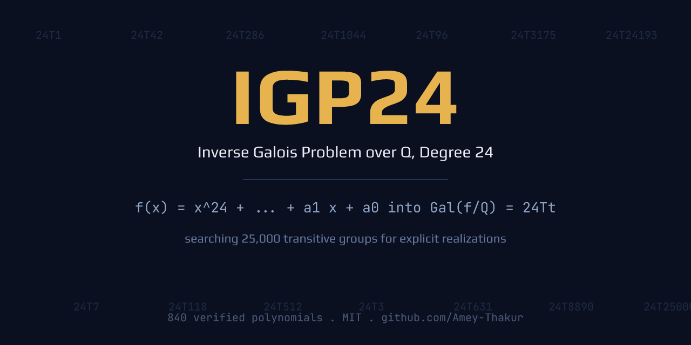

# SAIR Inverse Galois Problem Challenge (IGP24)

**Prepared by**: [Amey Thakur](https://github.com/Amey-Thakur)

Repository for the **SAIR Inverse Galois Problem Challenge (IGP24)**. An algebraic laboratory tracking and synthesizing explicit integer polynomial realizations for the 25,000 transitive permutation groups of degree 24.

---

## Research Scope

The Inverse Galois Problem over $\mathbb{Q}$ remains an open frontier. Degree 24 represents a critical computational boundary. This repository implements:
1. **LMFDB Integration**: Automated tracking and baseline comparison for known $(24T_t, r)$ realizations.
2. **Discriminant Optimization**: Local scoring tools interfacing with PARI/GP (`nfdisc`) to measure absolute number-field discriminants.
3. **Sandbox Validation**: Strict formatting parsers evaluating monic constraints and ascending coefficient layouts.
4. **Heuristic Search**: Sub-exponential bounds and algebraic construction strategies for missing transitive signatures.

---

## Directory Architecture

*   **[`submission.txt`](./submission.txt)**: The ready submission artifact, 840 verified degree 24 monic irreducible polynomials.
*   **[`SUBMISSION.md`](./SUBMISSION.md)**: How the batch is built, checked, and sent to the evaluator.
*   **[`scripts/`](./scripts/)**: The working pipeline: `generate_submission.py`, `validate_submission.py`, `build_api_payload.py`.
*   **[`data/`](./data/)**: The frozen LMFDB baseline CSV used for exclusion and threshold comparison.
*   **[`docs/`](./docs/)**: Competition mechanics, mathematical background, and strategy literature.
*   **[`src/datasets/`](./src/datasets/)**: Baseline loader over `data/lmfdb_baseline.csv` (pairs and thresholds).
*   **[`src/evaluation/`](./src/evaluation/)**: PARI/GP wrapper for exact and mixed discriminants.
*   **[`src/search/`](./src/search/)**: Coefficient perturbation for local discriminant minimization.

---

## Development Workflow

1. **Baseline**: `py src/datasets/lmfdb_client.py` reports the frozen baseline (286 labels, 622 pairs) and the exact `nfdisc` thresholds a submission must beat to unlock a baseline pair.
2. **Generate**: `py scripts/generate_submission.py` writes `submission.txt` from cyclotomic, composition, and trinomial families, excluding every baseline polynomial.
3. **Validate**: `py scripts/validate_submission.py` re-derives every rule from scratch and must print `PASS`, proving each line irreducible, monic, degree 24, and baseline free.
4. **Submit**: upload `submission.txt` on the competition page, or `py scripts/build_api_payload.py` then POST `scripts/api_payload.json` to the API. See [`SUBMISSION.md`](./SUBMISSION.md).

The `24Tt` Galois label and real root count are computed by the official Magma verifier; this repository never claims a group it cannot prove.

---

## Acknowledgements

- **SAIR Foundation**: Challenge infrastructure and evaluation servers.
- **LMFDB**: L-functions and Modular Forms Database cataloging.
- **PARI/GP Team**: Number theory computational backend.