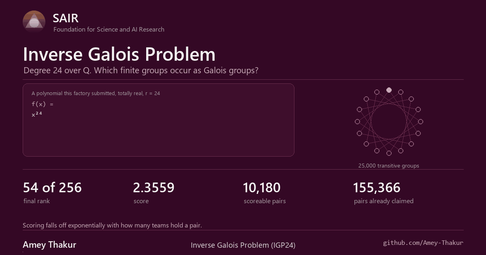
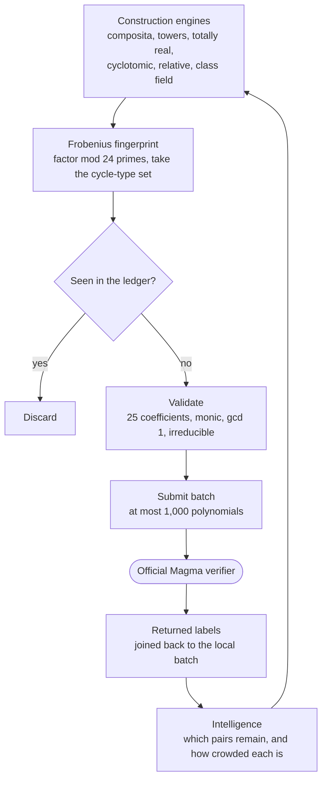

<div align="center">

<a href="https://competition.sair.foundation/competitions/igp24/overview" title="SAIR Foundation, open the competition"></a>

# Inverse Galois Problem (IGP24)

**Twenty-five thousand groups, and a search for polynomials that realise them.**

<br>

Degree 24 is where the inverse Galois problem stops being a theorem and starts
being a search. This is the factory that was built for it, the polynomials it
submitted, and an honest account of where its methods ran out.

<br>

[Method](#the-method) &nbsp;·&nbsp;
[Scoring](#how-scoring-works) &nbsp;·&nbsp;
[What was learned](#what-was-learned) &nbsp;·&nbsp;
[Submitting](SUBMISSION.md) &nbsp;·&nbsp;
[Competition](https://competition.sair.foundation/competitions/igp24/overview) &nbsp;·&nbsp;
[Discussions](https://github.com/Amey-Thakur/SAIR-INVERSE-GALOIS-PROBLEM-IGP24/discussions)

<br>

[](https://competition.sair.foundation/competitions/igp24/overview)
[](https://competition.sair.foundation/competitions/igp24/overview)
[](https://pari.math.u-bordeaux.fr/)
[](https://www.lmfdb.org/)
[](https://github.com/Amey-Thakur)
[](LICENSE)

<br>

<a href="https://github.com/Amey-Thakur" title="Amey Thakur on GitHub"></a>

</div>

---

<br>

## The problem

The inverse Galois problem asks whether every finite group is the Galois group
of some number field. Nobody knows. The degree-by-degree version is concrete
enough to attack by search.

> For every transitive permutation group `G` on 24 letters, find an irreducible
> integer polynomial of degree 24 whose Galois group is `G`.

There are **25,000** transitive groups of degree 24, labelled `24T1` through
`24T25000`. Each admits some set of signatures, where `r` is the number of real
roots and must be even and between 0 and 24. Across all groups that gives
**165,836** possible `(24Tt, r)` pairs.

Everything below degree 24 is essentially settled. Realisations are known for
every transitive group of degree 22 or less, and for all but one case in degree
23: the Mathieu group `M23`, also known as `23T5`, which remains open. Degree 24
is a different situation. The frozen LMFDB-derived baseline for this competition
covers **286** labels and **622** pairs, which is under half a per cent of the
possible surface.

Co-organised by **John Jones**, **Jen Paulhus**, **David Roe**,
**Andrew Sutherland** and **Terence Tao**, in collaboration with the
[LMFDB](https://www.lmfdb.org/), and run from 16 June to 15 August 2026.

> [!NOTE]
> Shafarevich's theorem says every finite solvable group occurs as a Galois
> group over the rationals, and 24,193 of the 25,000 degree-24 groups are
> solvable. The theorem does not hand over polynomials, which is exactly the
> gap this competition is trying to close.

<br>

## The submission format

One plain text file. Each line is 25 comma-separated integers in ascending
powers of `x`, so `a_0` first and `a_24` last.

```text
2,0,0,0,0,0,0,0,0,0,0,0,0,0,0,0,0,0,0,0,0,0,0,0,1
```

That is `x^24 + 2`, taken from the LMFDB baseline.

| Rule | Value |
| :--- | :--- |
| Monic | `a_24 = 1`, and `a_0 ≠ 0`. Non-monic lines are rejected |
| Comments | Anything after `#` is ignored, so a line may carry its own expected `(24Tt, r)` |
| Per submission | At most 1,000 polynomials, and at most 1,000,000 bytes |
| Per day | At most 200 submissions, so 200,000 polynomials, from 31 July 2026 |
| Verifier | Magma computes the `24Tt` label and the signature |
| Discriminants | PARI/GP `nfdisc`, with a 60 second timeout per polynomial |

> [!TIP]
> If a construction produces a non-monic polynomial with leading coefficient
> `a_24 > 1`, convert before submitting rather than discarding it. The
> polynomial `g(x) = a_24^23 · f(x / a_24)` is monic, has integer coefficients,
> and defines the same number field. Coefficient by coefficient that is
> `g_k = a_k · a_24^(23−k)`. Be aware that the conversion usually enlarges the
> absolute discriminant, which matters for scoring.

<br>

## How scoring works

This is the part that decides strategy, and it is not a volume game.

For each scoreable pair, let `k` be the number of credited teams holding it,
`D` the team's best official discriminant for that pair, and `D0` the smallest
such value among all credited teams. The team scores

```text
2^(1 − k) · log(D0) / log(D)
```

Which means:

| Situation | What the pair is worth |
| :--- | :--- |
| Only your team holds it | 1 point |
| An unlocked baseline pair, only your team beating LMFDB | 0.5 points, because LMFDB counts as one team |
| Two teams | about 0.5 points each |
| Ten teams | about 0.002 points each |

> [!IMPORTANT]
> The exponential term dominates everything. A pair held by ten teams is worth
> roughly one five-hundredth of a pair held alone. Discriminant size only ever
> applies a mild adjustment on top. **Rarity is the entire game, and volume
> without rarity is worth almost nothing.**

A baseline pair can be unlocked, but only by a successfully computed exact
`nfdisc` strictly smaller than the best baseline value for that pair. The mixed
discriminant fallback, `nfdisc([f,100000])`, is used when exact computation
times out on a non-baseline pair, and it can never unlock a baseline pair. Ties
pay nothing.

<br>

## The method

No Magma licence was available locally, so the group label could not be
computed here. The pipeline was built around that constraint: construct
structured candidates, predict their group cheaply, avoid re-submitting
anything already held, and let the official verifier settle the label.


```mermaid
flowchart TD
    E["Construction engines<br>composita, towers, totally real,<br>cyclotomic, relative, class field"] --> F["Frobenius fingerprint<br>factor mod 24 primes, take the cycle-type set"]
    F --> G{"Seen in the ledger?"}
    G -->|"yes"| X["Discard"]
    G -->|"no"| V["Validate<br>25 coefficients, monic, gcd 1, irreducible"]
    V --> S["Submit batch<br>at most 1,000 polynomials"]
    S --> M(["Official Magma verifier"])
    M --> L["Returned labels<br>joined back to the local batch"]
    L --> I["Intelligence<br>which pairs remain, and how crowded each is"]
    I --> E
```

The fingerprint is the piece worth knowing about. Factoring `f` modulo a fixed
set of primes gives a set of Frobenius cycle types, and by Chebotarev that set
is close to a signature for the Galois group. It costs about a millisecond,
against a Magma computation that is unavailable. Joining fingerprints back to
the labels the server returned gave 10,750 matched entries with 7 conflicts, so
as a predictor it is very nearly exact.

> [!CAUTION]
> It is exact in one direction only. Many distinct fingerprints collapse onto
> the same label, so novelty in fingerprint space badly overstates novelty in
> pair space. In one wave, 10,000 apparently novel clusters yielded only about
> 771 genuinely new pairs. Any pipeline that counts clusters as discoveries
> will report progress it has not made.

<br>

## The result

Final standing, from the leaderboard snapshot of 20 August 2026.

| | |
| --- | --- |
| Team | AVATAR, `IGP24-T00178` |
| Rank | 54 of 256 teams |
| Score | 2.3559 |
| Scoreable pairs | 10,180 |

The score is small because the scoring is exponential in how many teams hold a
pair, and every pair this factory reached was already crowded. Ten thousand
pairs and two and a third points is the arithmetic of arriving late to a space
that had already been swept. What follows is why that happened.

## What was learned

The most useful result here is a negative one, and it was measured rather than
guessed.

**Everything reachable was already taken.** As of 1 August 2026, of the 165,836
possible pairs, 155,366 already had at least one team on them. The modal pair
carried two teams and the most crowded carried 75. Every pair this factory
produced landed in that crowded mass.

**The gap is constructive, not computational.** Roughly 97 per cent of labelled
output landed on high-`t` generic groups, which every team reaches. The pairs
still unclaimed sit on groups these engines never produce, and reaching them
needs constructive Galois theory of the kind Magma provides and this setup did
not have.

**The class field theory campaign proved the point precisely.** Ray class field
sweeps over quartic, sextic and octic bases produced about 48,000 polynomials
and 1,410 pairs, of which 12 were nearly uncrowded. All 12 were inside the
frozen baseline, and on nine of them the discriminant came out exactly equal to
the baseline minimum rather than below it. The method had independently
re-derived LMFDB's own minimal fields to the digit. Unlocking requires strictly
smaller, so ties paid nothing.

That is the honest shape of it: the small-conductor class field zone **is** the
LMFDB baseline, so the tooling that reaches it arrives exactly where the ground
is already occupied.

> [!TIP]
> If you are attempting this problem, the finding worth taking is that engine
> choice decides everything and it is measurable early. Compositum
> constructions put 57 per cent of their output into the useful mid-`t` band,
> where towers managed 1.6 per cent. Grade a small wave, count where the labels
> land, and drop the engines that manufacture generic groups before spending
> days on them.

<br>

## What is where

| Path | What it holds |
| :--- | :--- |
| **[SUBMISSION.md](SUBMISSION.md)** | How a batch is built, checked and sent, and why diversity is the scoring lever |
| **[docs/](docs/README.md)** | Competition rules, mathematical background, and search strategy |
| **[scripts/](scripts/README.md)** | The pipeline: construction engines, fingerprinting, validation, the API client |
| [src/](src/) | The LMFDB baseline loader, the PARI/GP discriminant wrapper, and search heuristics |
| [data/](data/) | The frozen baseline, the ledger of everything submitted, returned labels, and crowding intelligence |
| [batches/](batches/) | Factory output, one file per submission, each line a distinct candidate |
| [submission.txt](submission.txt) | The first submission artefact, 840 accepted degree-24 polynomials |

<br>

## Reproduce it

Requires Python 3.10 or newer. PARI/GP is optional and only needed for exact
discriminants.

```bash
pip install -r requirements.txt
```

Check the frozen baseline, then build and validate a batch:

```bash
python src/datasets/lmfdb_client.py
python scripts/factory.py --batches 1
python scripts/validate_submission.py
```

`validate_submission.py` re-derives every rule from scratch and must print
`PASS`. It proves each line is 25 coefficients, monic, primitive and
irreducible, before anything is sent.

> [!NOTE]
> The `24Tt` label and the real root count are computed by the official Magma
> verifier. This repository never claims a group it cannot prove.

<br>

## Reading further

- [LMFDB degree 24 Galois groups](https://www.lmfdb.org/GaloisGroup/?n=24), the complete group index
- [Equational Theories Project](https://github.com/teorth/equational_theories), a sibling large-scale verified mathematics effort
- [PARI/GP](https://pari.math.u-bordeaux.fr/), the discriminant backend used for scoring

<br>

---

<div align="center">

### SAIR Foundation competitions

| Repository | Challenge |
| :--- | :--- |
| [SAIR-INVERSE-GALOIS-PROBLEM-IGP24](https://github.com/Amey-Thakur/SAIR-INVERSE-GALOIS-PROBLEM-IGP24) | Inverse Galois Problem in degree 24 |
| [SAIR-MATHEMATICS-DISTILLATION-CHALLENGE](https://github.com/Amey-Thakur/SAIR-MATHEMATICS-DISTILLATION-CHALLENGE) | Equational Theories, Stage 1 and Stage 2 |
| [SAIR-MODULAR-ARITHMETIC-CHALLENGE](https://github.com/Amey-Thakur/SAIR-MODULAR-ARITHMETIC-CHALLENGE) | Exact modular multiplication by neural induction |
| [SAIR-LEAN-KERNEL-CHALLENGE](https://github.com/Amey-Thakur/SAIR-LEAN-KERNEL-CHALLENGE) | An independent proof checker for Lean 4 |

<br>

Prepared by **[Amey Thakur](https://github.com/Amey-Thakur)** &nbsp;·&nbsp;
ORCID [0000-0001-5644-1575](https://orcid.org/0000-0001-5644-1575)

<sub>Released under <a href="LICENSE">CC BY 4.0</a>, with citation metadata in <a href="CITATION.cff">CITATION.cff</a>.<br>
Baseline data derived from the <a href="https://www.lmfdb.org/">LMFDB</a>, which keeps its own licence.</sub>

</div>
