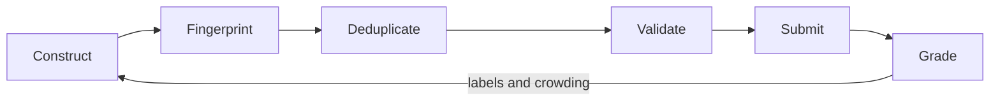

# The pipeline

**Construct, fingerprint, deduplicate, validate, submit, then learn from what came back.**

[Back to the repository](../README.md) &nbsp;·&nbsp;
[Submitting](../SUBMISSION.md) &nbsp;·&nbsp;
[Documentation](../docs/README.md)

---

Every script here exists because the group label could not be computed
locally. Magma settles the label, so the job of this code is to make each
submitted line as likely as possible to be a group nobody else has.

 

## Construction

Each engine reaches a different part of the group space. The measured yield
into the useful mid-`t` band is the reason they are not treated equally.

| Script | What it builds |
| :--- | :--- |
| [factory.py](factory.py) | The batch factory. Runs the engines, applies the target buckets, writes numbered batch files |
| [cyclotomic.py](cyclotomic.py) | Cyclotomic fields with `φ(n) = 24`. Abelian, rare, tiny discriminants, all inside the baseline |
| [relative.py](relative.py) | Quadratic extensions over degree-12 base fields, with exact signature control |
| [nf_bases.py](nf_bases.py) &nbsp;·&nbsp; [nf_bases_small.py](nf_bases_small.py) | Base field pools: degree 12 by group, and small quartic, sextic and octic bases |
| [pari_cft.py](pari_cft.py) &nbsp;·&nbsp; [pari_sweep.py](pari_sweep.py) | Ray class fields through PARI/GP `bnrinit` and `bnrclassfield`, swept across conductors and archimedean patterns |

 

## Prediction and targeting

| Script | What it does |
| :--- | :--- |
| [fingerprint.py](fingerprint.py) | Factors a polynomial modulo a fixed prime set and returns the Frobenius cycle-type set. About a millisecond per candidate |
| [lmfdb_groups.py](lmfdb_groups.py) | Downloads generators for the degree-24 transitive groups |
| [group_profiles.py](group_profiles.py) | Samples each group to build its cycle-type distribution |
| [predict_label.py](predict_label.py) | Chebotarev likelihood matcher over those profiles, with an abstain margin |
| [block_targets.py](block_targets.py) &nbsp;·&nbsp; [steered.py](steered.py) &nbsp;·&nbsp; [targeted2.py](targeted2.py) &nbsp;·&nbsp; [microtarget.py](microtarget.py) | Successive attempts to aim at specific unclaimed signatures rather than sampling and hoping |
| [frozen_attack.py](frozen_attack.py) | Attempts to beat baseline discriminants, which is the only way a baseline pair unlocks |

> [!WARNING]
> The predictor is confidently wrong when its profile database is incomplete.
> Run against a partial set of group profiles it returned high-confidence
> answers that were entirely incorrect, because the candidate set contained
> only the groups it had profiled so far. The gate stays off until the profile
> count is complete.

 

## Validation and submission

| Script | What it does |
| :--- | :--- |
| [validate_submission.py](validate_submission.py) | The independent gate. Re-derives every rule from scratch and prints `PASS` or fails |
| [generate_submission.py](generate_submission.py) | Writes `submission.txt` from the structured families, excluding baseline polynomials |
| [build_api_payload.py](build_api_payload.py) | Turns a batch into the JSON payload the API expects |
| [sair_api.py](sair_api.py) | The API client: `remaining`, `submit`, `results`, `labels`, `progress` |
| [submit_many.py](submit_many.py) | Bulk submission across many batch files |
| [polred.py](polred.py) | `polredbest` reduction, which lowers the discriminant of an equivalent field |

> [!IMPORTANT]
> `validate_submission.py` deliberately shares no code with the generators. It
> re-checks the coefficient count, monicity, primitivity and irreducibility
> from the file on disk, so a bug in a generator cannot pass unnoticed through
> a shared helper.

 

## The intelligence loop

`sair_api.py labels` joins the labels the server returned back onto the local
batch files, and `sair_api.py progress` records how many teams hold each
signature. Together they answer the only question that matters for scoring:
not what is new, but what is **uncrowded**.

The ledger in [`../data/ledger.jsonl`](../data/) records every cluster already
submitted, so the factory never spends a slot on something it has sent before.

**[Back to the repository](../README.md)** &nbsp;·&nbsp;
**[How a batch is submitted](../SUBMISSION.md)**
